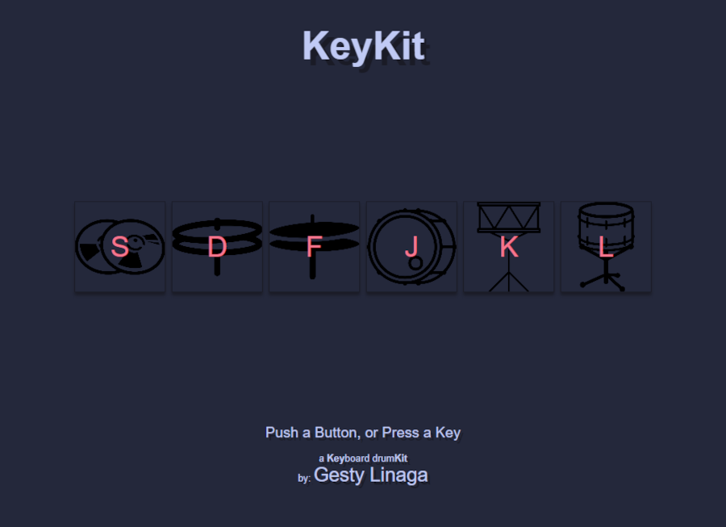

# KeyKit
A **Key**board drum**Kit** in your browser.

[Link to Live Site](https://gestylinaga.github.io/keykit/)

> Turn your keyboard into a mini drum kit!

## Usage
|Drum Sound|...|Keyboard Shortcut|
|-:|-|:-:|
|Ride| |s|
|Open Hi-Hat| |d|
|Closed Hi-Hat| |f|
|Kick/Bass| |j|
|Snare| |k|
|Floor Tom| |l|

or:

Click the Buttons.

## Preview

--- 
[Link to Live Site](https://gestylinaga.github.io/keykit/)

Inspired by: [k4](https://github.com/kanhadharmikk/k4)
